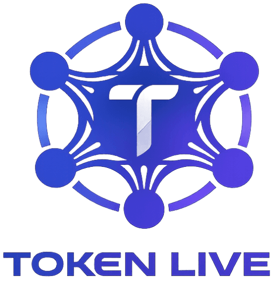
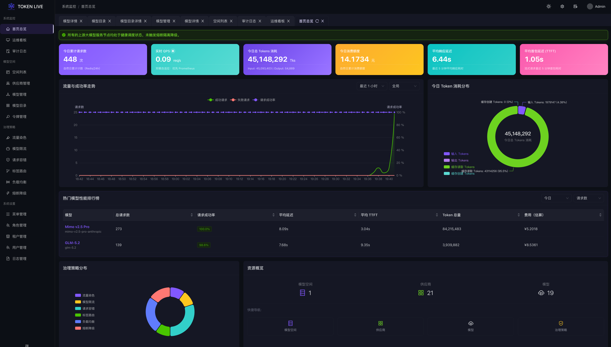
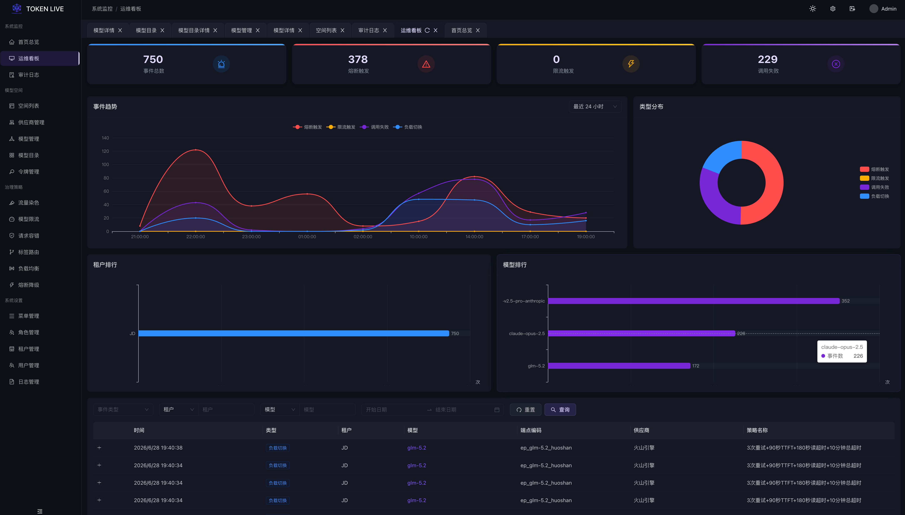

<div align="center">
  <a href="https://github.com/tokenlive/tokenlive-admin">
    
  </a>
  <br>
  <br>

[](LICENSE)

  <h1>TokenLive Admin</h1>
</div>

> [English](README.md)
>
> 📖 **“在代码的脉络里，让治理永续，让生命长青。”** — 纪念 TokenLive 的由来与精神传承，详见 [TokenLive 命名故事](./docs/origin_of_tokenlive.md)。

## 项目介绍

TokenLive Admin (TokenLive 控制台) 是 [TokenLive](https://github.com/tokenlive/tokenlive-gateway) 的管理控制台。本项目是一款专为大模型（LLM）算力生态打造的高性能、企业级大模型网关。网关基于成熟的微服务治理模型设计，内置丰富的智能路由与流量治理策略，天然支持海量并发流量与弹性横向扩容。通过深度优化请求链路，网关能够极大降低LLM调用失败率，为高并发、高可用的AI应用场景提供坚如磐石的稳定性保障。





## 功能特性

### 基础资源管理

管理 AI 模型**供应商**（如 OpenAI、Azure、自定义接入点）及其下的**模型**。每个模型支持多别名、多接入点的加权路由配置。

### 治理策略

在网关层面提供丰富的流量治理策略：

- **路由策略** — 基于标签的请求路由与路由详情配置
- **限流策略** — 服务端与客户端流量控制
- **熔断隔离** — 基于失败率、慢调用率、TTFT 等指标的自动熔断，支持降级响应配置
- **故障注入** — 模拟延迟与错误，用于高可用演练
- **负载均衡** — 可插拔的负载均衡策略
- **服务鉴权** — 服务间双向认证
- **调用管理** — 跨服务调用链配置
- **访问权限** — 细粒度的 API 级别权限控制

### RBAC 与系统管理

- 基于 Casbin 的角色权限控制
- 菜单与权限管理（支持资源分组）
- 用户管理（含部门分组）
- API Key 管理（用于下游客户端认证与计量）
- 操作日志审计

### 空间管理

多空间（租户级）资源隔离，用于组织供应商、模型和策略的归属。

## 项目结构

本项目采用前后端一体化架构：

- **前端**：Vue 3 + Vite + Ant Design Vue
- **后端**：Go + Gin + GORM
- **部署**：Docker 多阶段构建，单一镜像包含前后端

```
tokenlive-admin/
├── frontend/              # 前端 Vue 3 SPA
│   └── src/
│       ├── apis/modules/  # API 服务模块（与后端模块对应）
│       ├── router/routes/ # 路由定义（菜单驱动，动态路由）
│       ├── views/         # 按领域划分的页面组件
│       └── store/         # Pinia 状态管理
├── internal/              # 后端 Go 代码
│   ├── mods/              # 领域模块（rbac, resource, space, policy）
│   │   ├── api/           # HTTP 处理器
│   │   ├── biz/           # 业务逻辑
│   │   ├── dal/           # 数据访问层（GORM）
│   │   └── schema/        # 数据模型与 DTO
│   └── wirex/             # Google Wire 依赖注入
├── pkg/                   # 公共包（cachex, gormx, jwtx, middleware 等）
├── configs/               # TOML 配置文件
├── cmd/                   # CLI 命令（start/stop/version）
├── scripts/               # 数据库初始化脚本
├── docs/                  # Swagger 文档、ADR、规格说明
├── main.go                # 程序入口
├── Makefile               # 构建脚本
├── Dockerfile             # Docker 多阶段构建
└── docker-compose.yml     # Docker Compose 配置
```

## 技术栈

| 层级 | 技术选型 |
|------|----------|
| 前端 | Vue 3, Vite, Ant Design Vue, Pinia |
| 后端 | Go, Gin, GORM, Google Wire |
| 认证 | JWT, Casbin RBAC |
| 数据库 | MySQL / PostgreSQL / SQLite |
| 缓存 | Redis / Badger / 内存缓存 |
| 部署 | Docker 多阶段构建, docker-compose |

## 快速开始

### 本地开发

#### 1. 准备工作

- Go 1.19+
- Node.js 18+
- MySQL 5.7+（或 PostgreSQL / SQLite）
- Redis 6.0+（可选，可使用内存缓存）

#### 2. 初始化数据库

创建数据库并导入表结构：

```sql
CREATE DATABASE tokenlive CHARACTER SET utf8mb4 COLLATE utf8mb4_bin;
```

```bash
mysql -u root tokenlive < scripts/init.sql
```

#### 3. 修改配置

编辑 `configs/dev/server.toml` 中的数据库和缓存连接信息。

#### 4. 构建并运行

```bash
# 构建前后端并启动
make serve

# 或仅运行后端（支持 air 热重载）
make start
```

#### 5. 访问

打开浏览器访问 `http://localhost:8040`，默认管理员账号：

- 用户名：`admin`
- 密码：`admin`

### Docker 部署

```bash
# 构建镜像
make docker-build

# 使用 Docker Compose 启动（推荐）
docker-compose up -d
```

详见 [DEPLOY.md](DEPLOY.md)。

## 构建命令

```bash
make start             # 运行后端（air 热重载）
make build             # 构建后端二进制到 bin/tokenlive-admin
make build-frontend    # 构建前端到 frontend/dist
make build-all         # 构建前后端
make serve             # 构建全部并在 :8040 启动服务
make wire              # 重新生成 Wire 依赖注入代码
make swagger           # 重新生成 Swagger 文档
make docker-build      # 构建 Docker 镜像
make docker-push       # 构建并推送镜像
make clean             # 清理构建产物
make build-cross-all   # 交叉编译（linux/darwin/windows）
```

## 配置说明

### 前端

- `frontend/.env.dev` — 开发环境
- `frontend/.env.prod` — 生产环境

### 后端（TOML）

配置文件位于 `configs/` 目录：

- `configs/dev/` — 开发环境（MySQL + Redis）
- `configs/prod/` — 生产环境

关键配置段：`[General]`、`[Storage]`、`[Storage.DB]`、`[Storage.Cache]`、`[Middleware]`。

## API 结构

所有 API 以 `/api/v1/` 为前缀，遵循标准 CRUD 模式：

| 方法 | 路径 | 说明 |
|------|------|------|
| `GET` | `/<resource>` | 查询列表 |
| `GET` | `/<resource>/:id` | 按 ID 查询 |
| `POST` | `/<resource>` | 创建 |
| `PUT` | `/<resource>/:id` | 更新 |
| `DELETE` | `/<resource>/:id` | 删除 |

Swagger 文档通过注解自动生成，运行 `make swagger` 重新生成。

## 常见问题

### Q: 如何修改前端 API 地址？

修改 `frontend/.env.prod` 中的 `VITE_API_HTTP` 配置，然后重新构建。

### Q: 如何持久化数据？

使用 Docker Compose 时，数据会自动挂载到 `./data` 目录。

### Q: 如何查看日志？

```bash
docker-compose logs -f tokenlive-admin
```

## 许可证

本项目采用 Apache 许可证，详情请查看 [LICENSE](LICENSE) 文件。
