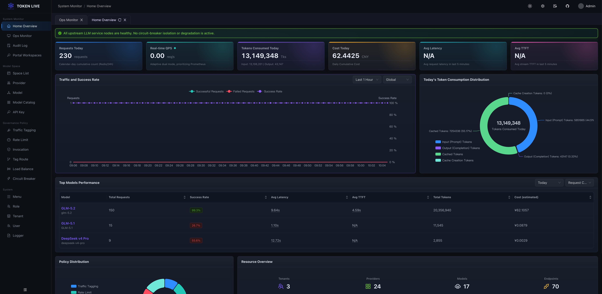
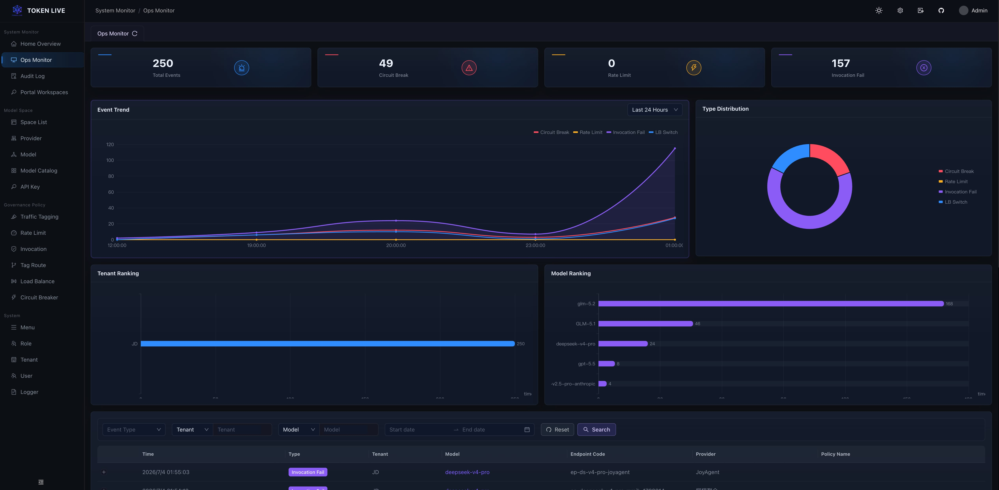

<div align="center">
  <a href="https://github.com/tokenlive/tokenlive-admin">
    
  </a>
  <br>
  <br>

[](LICENSE)

  <h1>TokenLive Admin</h1>
</div>

> [English](README.md)
>
> 📖 **“在代码的脉络里，让治理永续，让生命长青。”** — 纪念 TokenLive 的由来与精神传承，详见 [TokenLive 命名故事](./docs/origin_of_tokenlive.md)。

## 项目介绍

TokenLive Admin (TokenLive 控制台) 是 [TokenLive](https://github.com/tokenlive/tokenlive-gateway) 生态的运营与管理控制台。它负责管理模型供应商、模型、接入点、租户授权、API Key、RBAC、观测视图以及网关策略配置。实际请求执行由 TokenLive Gateway 负责；Admin 侧聚焦于配置、审计和同步网关运行所需的数据。

### 在线体验

- **体验地址**：[https://tokenlive.store](https://tokenlive.store)
- **演示账号**：`admin`
- **演示密码**：`tokenlive`





## 功能特性

### 基础资源管理

管理 AI 模型**供应商**（如 OpenAI、Azure、自定义接入点）及其下的**模型**。每个模型支持多别名、多接入点的加权路由配置。

### 治理策略

提供网关策略配置页面，用于管理：

- **染色打标策略** — 配置请求打标规则，供后续路由使用
- **路由策略** — 基于标签的模型路由与路由详情配置
- **限流策略** — 按请求、Token 或成本维度配置限流规则
- **熔断隔离** — 基于失败率、慢调用率等指标的熔断隔离，支持 TTFT 慢调用指标与降级响应配置
- **负载均衡** — 配置接入点负载均衡策略
- **调用策略** — 配置 failfast/failover、重试规则与降级响应
- **策略绑定** — 按租户、用户、模型和优先级绑定策略

### RBAC 与系统管理

- 基于 Casbin 的角色权限控制
- 菜单与权限管理（支持资源分组）
- 用户管理（含部门分组）
- API Key 管理（用于下游客户端认证与计量）
- 操作日志审计

### 空间管理

多空间（租户级）资源隔离，用于组织供应商、模型和策略的归属。

## 项目结构

本项目采用前后端一体化架构：

- **前端**：Vue 3 + Vite + Ant Design Vue
- **后端**：Go + Gin + GORM
- **部署**：Docker 多阶段构建，单一镜像包含前后端

```
tokenlive-admin/
├── frontend/              # 前端 Vue 3 SPA
│   └── src/
│       ├── apis/modules/  # API 服务模块（与后端模块对应）
│       ├── router/routes/ # 路由定义（菜单驱动，动态路由）
│       ├── views/         # 按领域划分的页面组件
│       └── store/         # Pinia 状态管理
├── internal/              # 后端 Go 代码
│   ├── mods/              # 领域模块（rbac, resource, space, policy）
│   │   ├── api/           # HTTP 处理器
│   │   ├── biz/           # 业务逻辑
│   │   ├── dal/           # 数据访问层（GORM）
│   │   └── schema/        # 数据模型与 DTO
│   └── wirex/             # Google Wire 依赖注入
├── pkg/                   # 公共包（cachex, gormx, jwtx, middleware 等）
├── configs/               # TOML 配置文件
├── cmd/                   # CLI 命令（start/stop/version）
├── scripts/               # 数据库初始化脚本
├── docs/                  # Swagger 文档、ADR、规格说明
├── main.go                # 程序入口
├── Makefile               # 构建脚本
└── deploy/                # Docker 构建与 docker-compose 文件
```

## 技术栈

| 层级 | 技术选型 |
|------|----------|
| 前端 | Vue 3, Vite, Ant Design Vue, Pinia |
| 后端 | Go, Gin, GORM, Google Wire |
| 认证 | JWT, Casbin RBAC |
| 数据库 | MySQL / PostgreSQL / SQLite |
| 缓存 | Redis / Badger / 内存缓存 |
| 部署 | Docker 多阶段构建, docker-compose |

## 快速开始

### 本地开发

#### 1. 准备工作

- Go 1.19+
- Node.js 18+
- MySQL 5.7+（或 PostgreSQL / SQLite）
- Redis 6.0+（可选，可使用内存缓存）

#### 2. 初始化数据库

创建数据库并导入表结构：

```sql
CREATE DATABASE tokenlive CHARACTER SET utf8mb4 COLLATE utf8mb4_bin;
```

```bash
mysql -u root tokenlive < scripts/init.sql
```

#### 3. 修改配置

编辑 `configs/dev/server.toml` 中的数据库和缓存连接信息。

#### 4. 构建并运行

```bash
# 构建前后端并启动
make serve

# 或仅运行后端（支持 air 热重载）
make start
```

#### 5. 访问

打开浏览器访问 `http://localhost:8040`，默认管理员账号：

- 用户名：`admin`
- 密码：`admin`

### Docker 部署

```bash
# 构建镜像
make docker-build

# 使用 Docker Compose 启动（推荐）
cd deploy/docker-compose
docker-compose up -d
```

详见 [DEPLOY-zh.md](DEPLOY-zh.md) (或英文版 [DEPLOY.md](DEPLOY.md))。

### 生产部署

对于生产环境，强烈建议使用统一的编排部署项目 [tokenlive-deploy](https://github.com/tokenlive/tokenlive-deploy)。该项目提供了开箱即用的一键 Docker Compose 部署配置，集成了 Admin 控制台、Gateway 网关、Caddy 反向代理、Redis 以及 Prometheus 等核心组件。详细部署指引请参考 [DEPLOY-zh.md 中的生产部署一节](DEPLOY-zh.md#三使用-tokenlive-deploy-统一编排部署推荐) (或 [英文版](DEPLOY.md#3-orchestrated-deployment-with-tokenlive-deploy-recommended))。

## 构建命令

```bash
make start             # 运行后端（air 热重载）
make build             # 构建后端二进制到 bin/tokenlive-admin
make build-frontend    # 构建前端到 frontend/dist
make build-all         # 构建前后端
make serve             # 构建全部并在 :8040 启动服务
make wire              # 重新生成 Wire 依赖注入代码
make swagger           # 重新生成 Swagger 文档
make docker-build      # 构建 Docker 镜像
make docker-push       # 构建并推送镜像
make clean             # 清理构建产物
make build-cross-all   # 交叉编译（linux/darwin/windows）
```

## 配置说明

### 前端

- `frontend/.env.dev` — 开发环境
- `frontend/.env.prod` — 生产环境

### 后端（TOML）

配置文件位于 `configs/` 目录：

- `configs/dev/` — 开发环境（MySQL + Redis）
- `configs/prod/` — 生产环境

关键配置段：`[General]`、`[Storage]`、`[Storage.DB]`、`[Storage.Cache]`、`[Middleware]`。

#### 环境变量配置

敏感配置（密码、Token、连接串等）通过环境变量占位符配置。后端会从配置工作目录（默认 `configs/`）自动加载 `.env.local` 和 `.env`：

```bash
# 复制示例文件
cp configs/.env.example configs/.env

# 编辑本地配置
vi configs/.env
```

环境变量格式：`${VAR_NAME:default_value}`，例如 `${ROOT_PASSWORD:admin}`。已存在的系统环境变量优先级高于 `configs/.env`。

## API 结构

所有 API 以 `/api/v1/` 为前缀，遵循标准 CRUD 模式：

| 方法 | 路径 | 说明 |
|------|------|------|
| `GET` | `/<resource>` | 查询列表 |
| `GET` | `/<resource>/:id` | 按 ID 查询 |
| `POST` | `/<resource>` | 创建 |
| `PUT` | `/<resource>/:id` | 更新 |
| `DELETE` | `/<resource>/:id` | 删除 |

Swagger 文档通过注解自动生成，运行 `make swagger` 重新生成。

## 常见问题

### Q: 如何修改前端 API 地址？

修改 `frontend/.env.prod` 中的 `VITE_API_HTTP` 配置，然后重新构建。

### Q: 如何持久化数据？

使用 Docker Compose 时，数据会自动挂载到 `./data` 目录。

### Q: 如何查看日志？

```bash
cd deploy/docker-compose
docker-compose logs -f tokenlive
```

## 许可证

本项目采用 Apache 许可证，详情请查看 [LICENSE](LICENSE) 文件。
