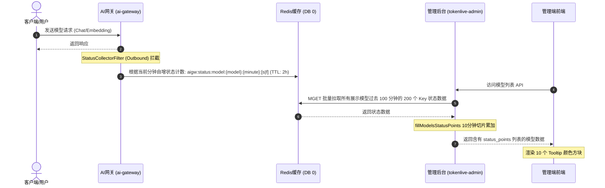

# 模型列表最近状态展示设计规格书

本文档描述了在模型列表页中增加“最近状态”列的设计与实现规范。

## 1. 目标

在 AI 网关管理端（`tokenlive-admin`）的模型列表中展示每个模型最近 100 分钟的状态，以 10 个 10 分钟切片作为颜色方块展示，实现对模型健康度、成功率的直观监控。

## 2. 架构设计与数据流

网关（`ai-gateway`）和管理后台（`tokenlive-admin`）基于共享 Redis 协同工作。



## 3. 详细设计

### 3.1 Redis 数据结构

以一分钟为时间窗口进行请求成功和失败计数：

- **成功 Key**: `aigw:status:model:{model_code}:{minute}:s` (String)
- **失败 Key**: `aigw:status:model:{model_code}:{minute}:f` (String)
- **过期时间**: 2 小时 (`7200` 秒)，自动清理，防止内存无限增长。
- **分钟计算**: `minute = UnixTimestamp / 60` (整数整除)。

### 3.2 网关侧修改 (`ai-gateway`)

1. **新增 Filter**: `pkg/filters/outbound/status_collector.go`
   - 实现 `core.OutboundFilter` 接口。
   - 在 `OnResponse` 中：
     - 若 `gctx.Model` 为空或 `rdb` 为空，直接返回。
     - 获取当前分钟 `minute = time.Now().Unix() / 60`。
     - 若 `gctx.Err == nil`，自增成功 Key；否则自增失败 Key。
     - 自增命令（使用 pipeline 保证原子和高效）：

       ```redis
       INCR key
       EXPIRE key 7200
       ```

2. **装配**:
   - 在 `cmd/server/wire/engine.go` 的 `NewGatewayEngine` 中注册 `status_collector`。
   - 在内置 pipeline（`chat_completion`, `embedding`, `messages`）的默认 OutboundFilters 配置中加上 `"status_collector"`。

### 3.3 管理后台后端修改 (`tokenlive-admin`)

1. **Schema 结构定义**:
   - 在 `internal/mods/resource/schema/model.go` 中新增结构体：

     ```go
     type ModelStatusPoint struct {
         SuccessCount int64 `json:"success_count"`
         FailCount    int64 `json:"fail_count"`
     }
     ```

   - 在 `Model` 结构体中新增字段：

     ```go
     StatusPoints []ModelStatusPoint `json:"status_points" gorm:"-"`
     ```

2. **BIZ 逻辑实现**:
   - 在 `internal/mods/resource/biz/model.biz.go` 中，给 `Model` 结构体注入 `RedisClient *redis.Client`。
   - 在 `Query` 中增加后置处理器 `fillModelsStatusPoints`。
   - **`fillModelsStatusPoints` 算法流程**：
     1. 获取 `currentMin = time.Now().Unix() / 60`。
     2. 对每个模型，生成过去 100 分钟的 200 个 Redis Key。
     3. 扁平化合并所有模型的 Key 数组，执行一次 Redis `MGET` 获取所有数据。
     4. 遍历每个模型的数据：
        - 还原 100 个分钟点的成功/失败计数。
        - 按照 `[0-9]`, `[10-19]`, ..., `[90-99]` 的索引范围，每 10 分钟切片累加为 1 个 `ModelStatusPoint`。
        - 将最后汇总得到的 10 个切片点赋值给该模型的 `StatusPoints` 字段。
3. **依赖注入编译**:
   - 在 `tokenlive-admin` 根目录下执行 `wire` 重新生成 `wire_gen.go`。

### 3.4 管理后台前端修改 (`tokenlive-admin/frontend`)

1. **列定义**:
   - 在 `frontend/src/views/resource/model.vue` 的 `columns` 里 `enabled` 列后添加：

     ```javascript
     { title: t('pages.model.recent_status'), key: 'recent_status', width: 220 },
     ```

2. **国际化配置**:
   - 在前端语言包 `src/locales/` 的中英文 JSON 中，给 `pages.model.recent_status` 翻译为 `"最近状态"` / `"Recent Status"`。
3. **元素渲染**:
   - 增加颜色方块样式逻辑和 Tooltip。
   - 方块样式 `width: 12px; height: 12px; border-radius: 2px; cursor: pointer;`。
   - 方块颜色决策：
     - `success == 0 && fail == 0` (白色/浅灰): `#f5f5f5`，边框 `1px solid #d9d9d9`。
     - `success > 0 && fail == 0` (绿色): `#52c41a`。
     - `success == 0 && fail > 0` (红色): `#f5222d`。
     - `success > 0 && fail > 0` (橘色): `#fa8c16`。
   - Tooltip 内容为：`成功: XX | 失败: XX`。

## 4. 边界处理与容错

- **网关 Redis 异常**：如果网关 Redis 连接失败，OutboundFilter 应捕获 Panic/Error 并仅进行日志记录，**绝对不能**中断客户端的 API 请求。
- **管理后台无 Redis**：如果管理后台未配置 Redis 或未启用缓存，`fillModelsStatusPoints` 直接返回空切片，列表页不渲染颜色或渲染默认空数据，以保证系统的可用性。
